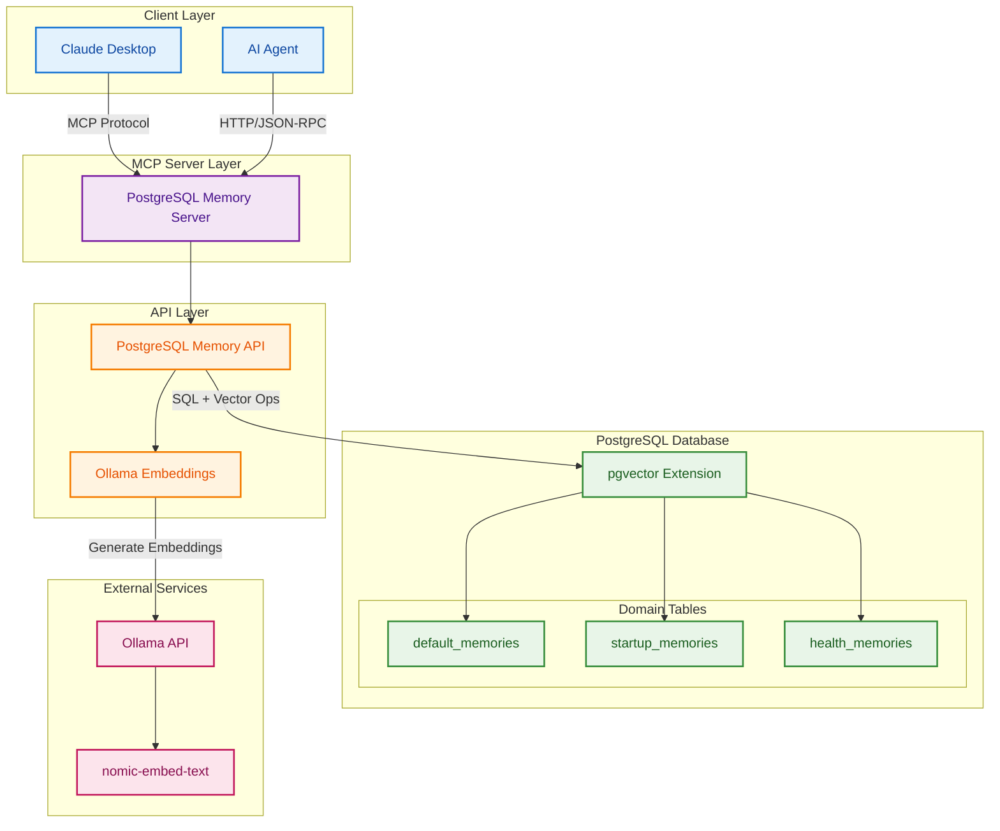

# Local Memory MCP - Target Architecture

## 🎯 Target Architecture Diagram



## 📊 Current vs Target State Analysis

### ✅ **What's Already Correct:**

| Component | Status | Current Implementation |
|-----------|--------|------------------------|
| PostgreSQL Memory Server | ✅ Working | `src/postgres_memory_server.py` - FastMCP server accepting MCP protocol |
| PostgreSQL Memory API | ✅ Working | `src/postgres_memory_api.py` - Handles DB operations |
| Ollama Embeddings | ✅ Working | `src/ollama_embeddings.py` - Generates vectors |
| pgvector Extension | ✅ Working | 768-dimensional vectors in PostgreSQL |
| MCP Protocol | ✅ Working | Claude Desktop can connect via STDIO |
| Ollama API | ✅ Working | Connected to `localhost:11434` |
| nomic-embed-text | ✅ Configured | Set in `.env` file |

### ⚠️ **What Needs Adjustment:**

| Required Change | Current State | Target State | Action Needed |
|-----------------|--------------|--------------|---------------|
| Domain Tables | `sentient-library-universal_memories`, `default_memories` | `default_memories`, `startup_memories`, `health_memories` | Create missing tables, migrate data |
| HTTP/JSON-RPC for AI Agent | Only STDIO transport | Both STDIO and HTTP | Add HTTP server endpoint to `postgres_memory_server.py` |
| Multiple Domain Support | Partial - uses table prefixes | Full domain isolation | Standardize domain handling |

### ❌ **Components to Remove/Disconnect:**

| Component | Reason | Action |
|-----------|--------|--------|
| `web_dashboard/` | Not in target architecture | Remove or keep as optional monitoring tool |
| `consolidation/` | Not in target architecture | Keep disconnected or remove |
| `enhanced_cli/` | Not in target architecture | Keep as separate tool or remove |
| SQLite files | Already removed | ✅ Done |
| Duplicate files | Clean up needed | Remove `memory_scoring.py` (keep `enhanced_cli` version) |

## 🔧 Implementation Tasks

### 1. **Database Schema Alignment**
```sql
-- Create missing domain tables
CREATE TABLE IF NOT EXISTS startup_memories (
    LIKE default_memories INCLUDING ALL
);

CREATE TABLE IF NOT EXISTS health_memories (
    LIKE default_memories INCLUDING ALL
);

-- Migrate existing data if needed
-- INSERT INTO startup_memories SELECT * FROM "sentient-library-universal_memories" WHERE ...
```

### 2. **Add HTTP/JSON-RPC Transport**
Update `postgres_memory_server.py` to support both transports:
```python
# Current: STDIO only
mcp = FastMCP("Local Context Memory")

# Target: Add HTTP support
from fastmcp.server import HTTPServer
http_server = HTTPServer(mcp, port=8080)
```

### 3. **Standardize Domain Handling**
Current: Different table names with prefixes
Target: Clean domain-based table routing

### 4. **Clean Project Structure**
```bash
# Remove disconnected components
rm -rf src/web_dashboard/
rm src/memory_scoring.py  # Keep enhanced_cli version
rm src/context_formatter.py  # If not needed
rm src/project_detector.py  # If not needed
rm src/time_parsing.py  # If not needed

# Keep as separate tools (optional)
# src/enhanced_cli/  - Useful CLI tool
# src/consolidation/  - Memory management system
```

## 📈 Migration Path

1. **Phase 1**: Database schema update
   - Create new domain tables
   - Migrate existing data

2. **Phase 2**: Server updates
   - Add HTTP transport support
   - Ensure both MCP and HTTP/JSON-RPC work

3. **Phase 3**: Cleanup
   - Remove unused components
   - Consolidate duplicate code

4. **Phase 4**: Testing
   - Test Claude Desktop connection (MCP)
   - Test AI Agent connection (HTTP)
   - Verify all domain tables work

## 🎯 Final Architecture Benefits

- **Cleaner**: Only essential components connected
- **Scalable**: Multiple domains with separate tables
- **Flexible**: Supports both MCP (Claude) and HTTP (AI agents)
- **Maintainable**: No duplicate code or orphaned modules